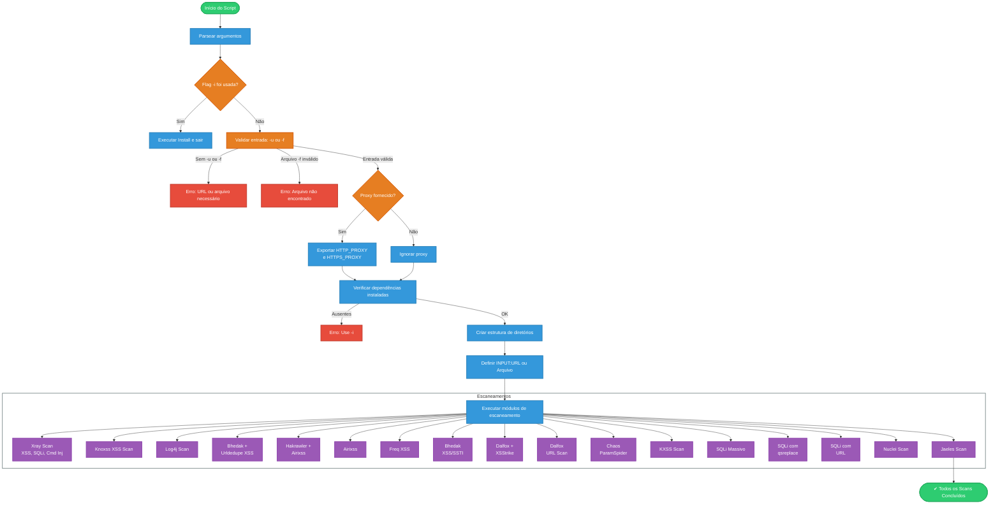

**VARS** (Vulnerability Automated Recon Suite) é um script Bash poderoso e automatizado para **varredura de vulnerabilidades web**, combinando as melhores ferramentas do ecossistema de bug bounty, pentest e red teaming.

---

##  Funcionalidades

- ✅ Escaneia URLs individuais ou arquivos com listas de domínios
- ✅ Detecta automaticamente:
  - Cross-Site Scripting (XSS)
  - SQL Injection (SQLi)
  - Server-Side Template Injection (SSTI)
  - Log4Shell (CVE-2021-44228)
-  Coleta de parâmetros ocultos com ParamSpider
-  Resultados organizados em diretórios por categoria (xss, sqli, etc.)
-  Totalmente automatizado e fácil de usar
-  Integração com ferramentas líderes do mercado (Nuclei, Jaeles, Knoxss, XSStrike, Dalfox, Xray, etc.)
-  Suporte a proxy HTTP para redirecionamento via Burp/ZAP

---

##  Ferramentas utilizadas

O VARS integra e automatiza o uso de diversas ferramentas de segurança:

| Ferramenta       | Finalidade                          |
|------------------|--------------------------------------|
| `httpx`          | Verificação de URLs ativas          |
| `gf`             | Filtros para XSS, SQLi, etc.         |
| `dalfox`         | XSS avançado e fuzzing              |
| `nuclei`         | PoC scanner baseado em templates     |
| `jaeles`         | Scanner modular com fuzzing         |
| `xsstrike`       | Detecção e exploração de XSS         |
| `sqlmap`         | Teste de injeção SQL automatizado    |
| `xray`           | Scanner avançado para web vulns     |
| `paramspider`    | Coleta de parâmetros de URLs         |
| `log4j-scan`     | Scanner para Log4Shell               |
| `bhedak`, `airixss`, `kxss`, `freq` | Detecção e fuzz complementar |

---

##  Instalação

Para instalar todas as dependências necessárias, execute:

```bash
chmod +x vars.sh
./vars.sh -i
```

---

##  Uso

```bash
./vars.sh [opções]
```

### Opções disponíveis:

| Opção | Descrição                                                  |
| ----- | ---------------------------------------------------------- |
| `-u`  | Escanear uma única URL (ex: `https://testphp.vulnweb.com`) |
| `-f`  | Escanear URLs de um arquivo (uma por linha)                |
| `-o`  | Diretório de saída (padrão: `url_vuln_scan_results`)       |
| `-p`  | Definir proxy HTTP (ex: `http://127.0.0.1:8080`)           |
| `-i`  | Instalar dependências                                      |
| `-h`  | Exibir ajuda                                               |

### Exemplos:

```bash
./vars.sh -u https://example.com -o results
./vars.sh -f targets.txt -o results -p http://127.0.0.1:8080
./vars.sh -i
```

---

##  Requisitos

- Go instalado (`sudo apt install golang`)
- Python3 + pip3
- Linux com permissão de escrita em `/tmp`

---

##  Estrutura dos Resultados

```
url_vuln_scan_results/
├── xss/
├── sqli/
├── log4j/
├── misc/
```

---

##  Metodologia

Abaixo está o diagrama da metodologia do script, representado em Mermaid, ilustrando o fluxo de execução desde a entrada até a geração dos resultados:



##  Contribuição

Pull Requests e sugestões são bem-vindas! Abra uma issue ou envie seu PR.

---

## ⚠️ Aviso Legal

Este script foi desenvolvido **exclusivamente para fins educacionais e de teste em ambientes autorizados**. O uso indevido pode violar leis locais. **Use com responsabilidade.**
