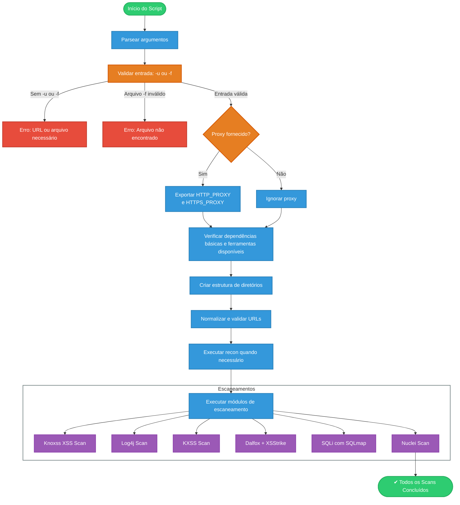

**VARS** (Vulnerability Automated Recon Suite) é um script Bash poderoso e automatizado para **varredura de vulnerabilidades web**, combinando ferramentas do ecossistema de bug bounty, pentest e red teaming.

---

##  Funcionalidades

- ✅ Escaneia URLs individuais ou arquivos com listas de URLs
- ✅ Detecta automaticamente:
  - Cross-Site Scripting (XSS)
  - SQL Injection (SQLi)
  - Server-Side Template Injection (SSTI), quando suportado pelas ferramentas integradas
  - Log4Shell (CVE-2021-44228)
-  Coleta e normalização de URLs com ferramentas de recon
-  Resultados organizados em diretórios por categoria (xss, sqli, etc.)
-  Totalmente automatizado e fácil de usar
-  Integração com ferramentas líderes do mercado (Nuclei, Knoxss, XSStrike, Dalfox, Xray, etc.)
-  Suporte a proxy HTTP/HTTPS para redirecionamento via Burp/ZAP
-  Execução por módulos através da opção `-m`
-  Tratamento de erros, diretório temporário isolado e limpeza automática

---

##  Ferramentas utilizadas

O VARS integra e automatiza o uso de diversas ferramentas de segurança:

| Ferramenta       | Finalidade                          |
|------------------|--------------------------------------|
| `httpx`          | Verificação de URLs ativas          |
| `gf`             | Filtros para XSS, SQLi, etc.         |
| `dalfox`         | XSS avançado e fuzzing              |
| `nuclei`         | PoC scanner baseado em templates     |
| `jaeles`         | Scanner modular com fuzzing         |
| `xsstrike`       | Detecção e exploração de XSS         |
| `sqlmap`         | Teste de injeção SQL automatizado    |
| `xray`           | Scanner avançado para web vulns     |
| `paramspider`    | Coleta de parâmetros de URLs         |
| `log4j-scan`     | Scanner para Log4Shell               |
| `bhedak`, `airixss`, `kxss`, `freq` | Detecção e fuzz complementar |

---

##  Instalação

O VARS não instala automaticamente as dependências. Instale as ferramentas que deseja utilizar e deixe-as disponíveis no `PATH`.

Dependências básicas:

- Bash 4+
- curl
- git
- awk, grep, sed, sort, xargs e mktemp

Ferramentas de scanner são opcionais; o VARS executa os módulos disponíveis e informa as ferramentas encontradas no início da execução.

```bash
chmod +x vars.sh
./vars.sh -h
```

> Para ferramentas Python mantidas fora do `PATH`, configure os caminhos usando as variáveis `VARS_TOOLS_DIR`, `VARS_PARAMSPIDER`, `VARS_XSSTRIKE` ou `VARS_LOG4J_SCAN`.

---

##  Uso

```bash
./vars.sh [opções]
```

### Opções disponíveis:

| Opção | Descrição                                                  |
| ----- | ---------------------------------------------------------- |
| `-u`  | Escanear uma única URL (ex: `https://testphp.vulnweb.com`) |
| `-f`  | Escanear URLs de um arquivo (uma por linha)                |
| `-o`  | Diretório de saída (padrão: `vars_results`)                |
| `-m`  | Modo de execução: `full`, `recon`, `xss`, `sqli`, `nuclei` ou `log4j` |
| `-j`  | Concorrência utilizada pelas ferramentas que suportam threads |
| `-t`  | Timeout em segundos para integrações HTTP compatíveis      |
| `-p`  | Definir proxy HTTP/HTTPS (ex: `http://127.0.0.1:8080`)    |
| `-k`  | Definir a chave da API do Knoxss                           |
| `--keep-going` | Continuar quando um módulo falhar                  |
| `-h`  | Exibir ajuda                                               |
| `-v`  | Exibir versão                                              |

### Exemplos:

```bash
./vars.sh -u https://example.com
./vars.sh -u https://example.com -m recon
./vars.sh -u https://example.com -m xss
./vars.sh -f targets.txt -m sqli -o results
./vars.sh -f targets.txt -m full -j 10
./vars.sh -f targets.txt -p http://127.0.0.1:8080
KNOXSS_API_KEY="[SUA_CHAVE]" ./vars.sh -f targets.txt -m xss
```

### Modos de execução:

| Modo | Descrição |
|------|-----------|
| `recon` | Reconhecimento, descoberta e normalização de URLs |
| `xss` | Recon + scanners de XSS |
| `sqli` | Recon + candidatos SQLi + SQLmap/Nuclei |
| `nuclei` | Nuclei sobre os alvos fornecidos |
| `log4j` | Avaliação Log4j nos alvos fornecidos |
| `full` | Executa o pipeline completo |

---

##  Requisitos

- Bash 4+
- `curl`, `git`, `awk`, `grep`, `sed`, `sort`, `xargs` e `mktemp`
- Linux com permissão de escrita em diretório temporário
- Ferramentas de segurança desejadas instaladas e disponíveis no `PATH`

Ferramentas opcionais reconhecidas incluem `httpx`, `gau`, `uro`, `gf`, `dalfox`, `nuclei`, `sqlmap`, `jaeles`, `xray`, `kxss`, `bhedak`, `airixss`, `freq`, `hakrawler`, `qsreplace`, `anew`, `paramspider`, `xsstrike` e `log4j-scan`.

---

##  Estrutura dos Resultados

```
vars_results/
├── xss/
├── sqli/
├── log4j/
├── nuclei/
├── recon/
│   ├── live.txt
│   ├── gau.txt
│   ├── urls.txt
│   ├── crawl.txt
│   └── candidates.txt
├── misc/
└── meta/
    ├── run.txt
    └── targets.txt
```

---

##  Metodologia

Abaixo está o diagrama da metodologia do script, representado em Mermaid, ilustrando o fluxo de execução desde a entrada até a geração dos resultados:


```mermaid
flowchart TD
    Start([Início do Script]) --> Args[Parsear argumentos]
    Args --> ValidateInput[Validar entrada: -u ou -f]

    ValidateInput -->|Sem -u ou -f| ErrorNoInput[Erro: URL ou arquivo necessário]
    ValidateInput -->|Arquivo -f inválido| ErrorFile[Erro: Arquivo não encontrado]
    ValidateInput -->|Entrada válida| SetProxy{Proxy fornecido?}

    SetProxy -- Sim --> ConfigurarProxy[Exportar HTTP_PROXY\ne HTTPS_PROXY]
    SetProxy -- Não --> SkipProxy[Ignorar proxy]

    ConfigurarProxy --> CheckDeps
    SkipProxy --> CheckDeps

    CheckDeps[Verificar dependências básicas e ferramentas disponíveis] --> SetupOut[Criar estrutura de diretórios]
    SetupOut --> Normalize[Normalizar e validar URLs]
    Normalize --> Recon[Executar recon quando necessário]

    Recon --> Scans[Executar módulos de escaneamento]

    subgraph Escaneamentos
        Scans --> Knoxss[Knoxss XSS Scan]
        Scans --> Log4j[Log4j Scan]
        Scans --> KXSS[KXSS Scan]
        Scans --> DalfoxXS[Dalfox + XSStrike]
        Scans --> SQLiMass[SQLi com SQLmap]
        Scans --> Nuclei[Nuclei Scan]
    end

    Nuclei --> Done([✔ Todos os Scans Concluídos])

    %% Estilos
    classDef start fill:#2ecc71,stroke:#27ae60,stroke-width:2px,color:#fff
    classDef error fill:#e74c3c,stroke:#c0392b,stroke-width:2px,color:#fff
    classDef process fill:#3498db,stroke:#2980b9,stroke-width:2px,color:#fff
    classDef decision fill:#e67e22,stroke:#d35400,stroke-width:2px,color:#fff
    classDef scan fill:#9b59b6,stroke:#8e44ad,stroke-width:2px,color:#fff
    classDef subgraphStyle fill:none,stroke:#7f8c8d,stroke-width:2px

    class Start,Done start
    class Args,ConfigurarProxy,SkipProxy,CheckDeps,SetupOut,Normalize,Recon,Scans process
    class ErrorNoInput,ErrorFile error
    class SetProxy,ValidateInput decision
    class Knoxss,Log4j,KXSS,DalfoxXS,SQLiMass,Nuclei scan
    class Escaneamentos subgraphStyle
```

##  Contribuição

Pull Requests e sugestões são bem-vindas! Abra uma issue ou envie seu PR.

---

## ⚠️ Aviso Legal

Este script foi desenvolvido **exclusivamente para fins educacionais e de teste em ambientes autorizados**. O uso indevido pode violar leis locais. **Use com responsabilidade.**
